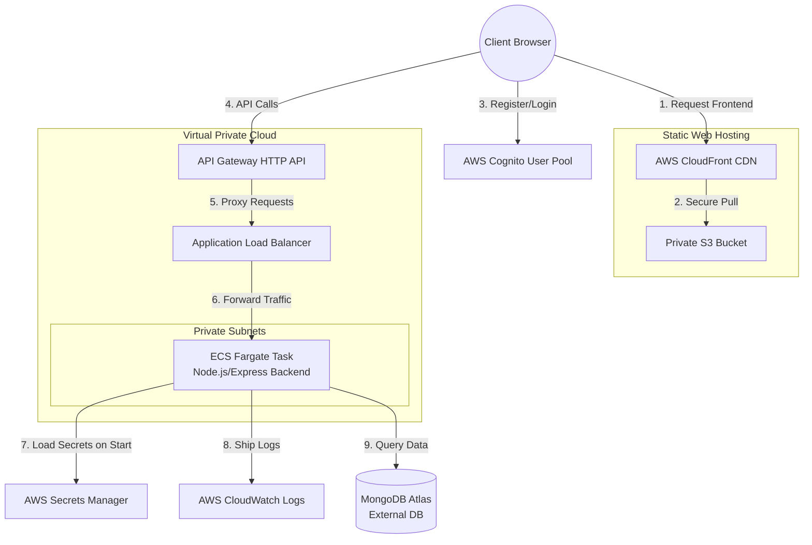

# AWS Architecture Analysis: Odoo Cafe POS

This document provides a detailed architectural analysis of the AWS services defined in the [infra/](file:///home/praveen/Desktop/Projects/Odoo/infra/) directory of the **Odoo Cafe POS** project. It details the system request flows, security posture, scalability, and structural design choices.

---

## 🗺️ Architectural Diagram & Request Flow

---

## 🛠️ Service Role Breakdown

### 1. Ingress & Routing Layer
* **Amazon API Gateway (HTTP API)** ([api_gateway.tf](file:///home/praveen/Desktop/Projects/Odoo/infra/api_gateway.tf)):
  * **Role:** Acts as the primary entrance for client API requests. It redirects wildcard requests (`/{proxy+}`) and root paths to the Application Load Balancer.
  * **Design Choice:** Uses **HTTP APIs** instead of REST APIs, which are lighter, faster, and cheaper for simple proxying.
* **Application Load Balancer (ALB)** ([ecs.tf:L30-L76](file:///home/praveen/Desktop/Projects/Odoo/infra/ecs.tf#L30-L76)):
  * **Role:** Receives proxy requests from API Gateway and routes them to active backend tasks inside the VPC.
  * **Design Choice:** Translates incoming public traffic into container target group traffic.

### 2. Compute Layer
* **Amazon ECS (Elastic Container Service) on AWS Fargate** ([ecs.tf:L79-L166](file:///home/praveen/Desktop/Projects/Odoo/infra/ecs.tf#L79-L166)):
  * **Role:** Hosts the containerized Node.js/Express backend server.
  * **Design Choice:** Configured to run on **AWS Fargate** (serverless containers), meaning you do not have to manage underlying EC2 virtual machines. It is sized small (`0.25 vCPU`, `512 MiB RAM`) to keep costs low.

### 3. Frontend Static Hosting Layer
* **Amazon S3 & AWS CloudFront** ([s3_cloudfront.tf](file:///home/praveen/Desktop/Projects/Odoo/infra/s3_cloudfront.tf)):
  * **Role:** S3 stores the compiled React frontend files. CloudFront caches and serves them worldwide with HTTPS.
  * **Design Choice:** **S3 Public Access is fully blocked.** CloudFront uses **Origin Access Control (OAC)** to sign requests, securing the bucket from direct access. Error pages (403/404) are redirected back to `index.html` to support client-side React Router routing.

### 4. Authentication Layer
* **Amazon Cognito User Pool** ([cognito.tf](file:///home/praveen/Desktop/Projects/Odoo/infra/cognito.tf)):
  * **Role:** Manages user directories, registration, password policies, and confirmation codes (sent via default email configuration).
  * **Design Choice:** Configured as a public client client (`generate_secret = false`) to allow direct authorization flows from the SPA frontend client.

### 5. Configuration & Secrets Management
* **AWS Secrets Manager** ([secrets.tf](file:///home/praveen/Desktop/Projects/Odoo/infra/secrets.tf)):
  * **Role:** Safely stores connection URIs, JWT signing keys, and email passwords.
  * **Design Choice:** The secrets are injected into the ECS tasks as environment variables upon startup via the ECS execution role policy ([iam.tf:L29-L54](file:///home/praveen/Desktop/Projects/Odoo/infra/iam.tf#L29-L54)).

---

## 🔒 Security Posture Analysis

1. **Least-Privilege IAM Roles:**
   * Separate execution roles are used for ECS. The `ecs_task_execution_role` is granted access *only* to the specific Secrets Manager secret ARN needed ([iam.tf:L42-L44](file:///home/praveen/Desktop/Projects/Odoo/infra/iam.tf#L42-L44)), preventing container-wide credential leakage.
2. **Network Isolation (Security Groups):**
   * The ECS tasks do not accept traffic from the public internet. The task security group ([security_groups.tf:L36-L61](file:///home/praveen/Desktop/Projects/Odoo/infra/security_groups.tf#L36-L61)) only allows ingress on port `5000` from the ALB security group.
3. **Data Protection:**
   * Enforced redirection of HTTP to HTTPS at the CloudFront level ([s3_cloudfront.tf:L59](file:///home/praveen/Desktop/Projects/Odoo/infra/s3_cloudfront.tf#L59)).
   * Environment variables are kept out of source code by utilizing AWS Secrets Manager.

---

## 📈 Scalability and Performance

* **Fargate Task Scaling:**
  * ECS is configured to maintain a `desired_count` of 1 task ([ecs.tf:L144](file:///home/praveen/Desktop/Projects/Odoo/infra/ecs.tf#L144)). For production scaling, Auto Scaling policies can be attached to scale based on CPU/Memory usage.
* **CDN Caching:**
  * CloudFront reduces loading times dramatically by caching static frontend code at Edge locations globally, offloading S3 traffic completely.

---

## 🛠️ Optimization Opportunities

1. **Remove the double-hop proxy:**
   * Having API Gateway routing to an ALB which then routes to ECS creates a "double hop" (API Gateway ➔ ALB ➔ ECS).
   * **Alternative:** You could use **API Gateway HTTP API integration with VPC Link** to route directly to ECS tasks in the private subnet without paying for an ALB base charge ($16.43/month).
2. **Container Insights:**
   * Container insights are enabled on the ECS cluster ([ecs.tf:L11-L13](file:///home/praveen/Desktop/Projects/Odoo/infra/ecs.tf#L11-L13)), which adds additional CloudWatch metrics. For dev/testing environments, this can be disabled to save cost.
